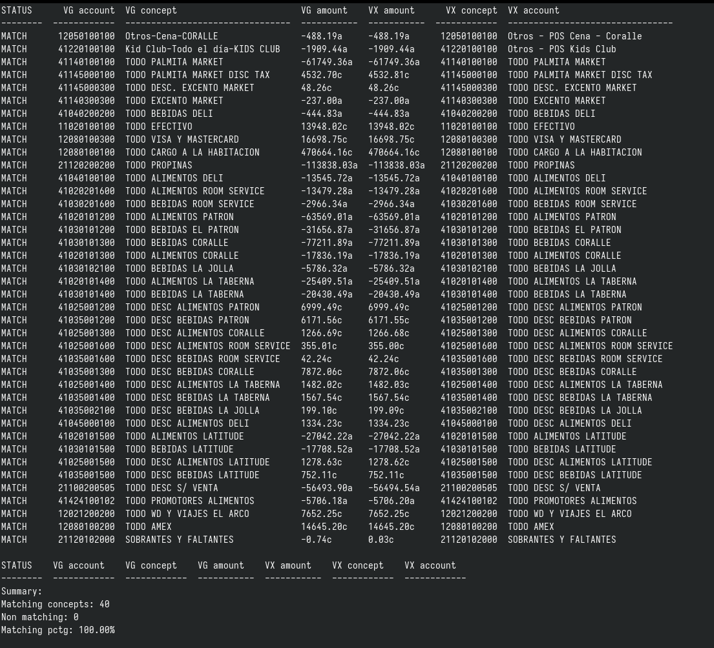

# Poliza scripts 

En este repositorio se encuentran herramientas para analizar, solicitar y procesar la póliza de Villagroup.

## `polizadiff.py`

Este es el principal elemento para realizar diferenciales entre la póliza generada por VG y la póliza generada
desde la instancia de odoo. El resultado es una "tabla" que especifica, concepto por concepto, el monto esperado
de VG y el monto considerado por vauxoo. 



Cuenta con dos modos de operación:

1. Diferencial por archivo: al ingresar dos archivos como entrada, se realiza una operación diferencial (ver foto arriba).
```
#                             Archivo VG                                     Archivo odoo
$ ./polizadiff.py ../polizas_api/POLIZAINGRESOS_20221231.json ../polizas_read_groups/POLIZAINGRESOS_VX20221231.csv --collapse-accounts
```

2. Diferencial por directorio: al ingresar dos directorios como parámetro, se buscan dos archivos dentro del mismo directorio para comparar, a través de una cadena que contiene la fecha de modo `"%Y%m%d"`, (ver ejemplo arriba).
   
```
$ ./polizadiff.py ../polizas_api ../polizas_vauxoo --collapse-accounts
```

### Archivo .collapse

En este directorio existe un archivo llamado .collapse, el cual de activarse la opción `--collapse-accounts`, tomará todos los conceptos bajo una misma cuenta contable,
los agrupará, sumará, y comparará los montos correspondientes, obteniendo un diferencial __por cuenta__.

## poliza_api.py

```
$ ./poliza_api.py
```

Este script obtiene las pólizas de la API publicada por VG de manera asíncrona. Se debe de modificar el archivo directamente para modifirar los parámetros de entrada, específicamente:

* `VG_POLIZA_URL_BASE`: Url externa del servicio.
* `POLIZA_OUTPUT_DIR`: Directorio local en donde se almacenarán las pólizas descargadas. 
* `d0`: fecha inicial de descaga
* `d1`: fecha final de descarga (no inclusiva)

NOTA: El proceso de descarga puede ser tardado dependiendo del rango de fechas.

### poliza2csv.py

Este script transforma un archivo de póliza obtenido de la API VG y lo convierte a un archivo .csv

```
$ ./poliza2csv.py ../polizas_anotadas/POLIZAINGRESOS_20221207.TXT > ../poliza_07_dec_2022/POLIZAINGRESOS_20221207.csv
```
